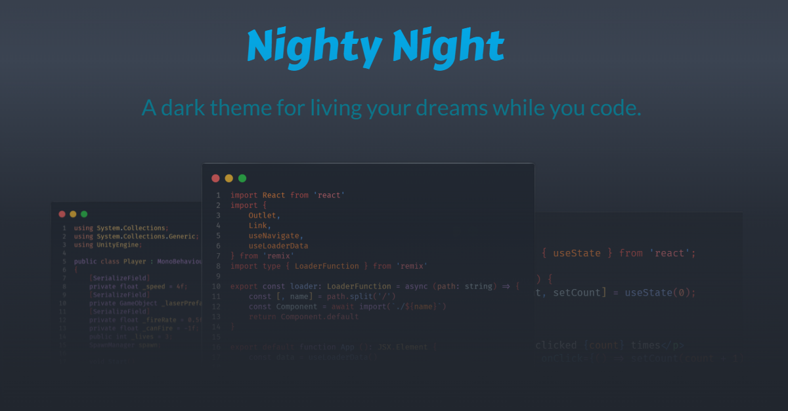
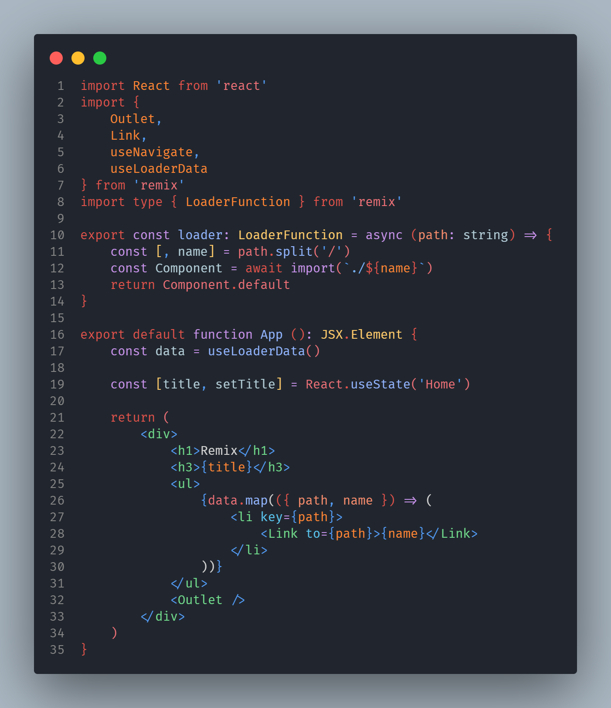
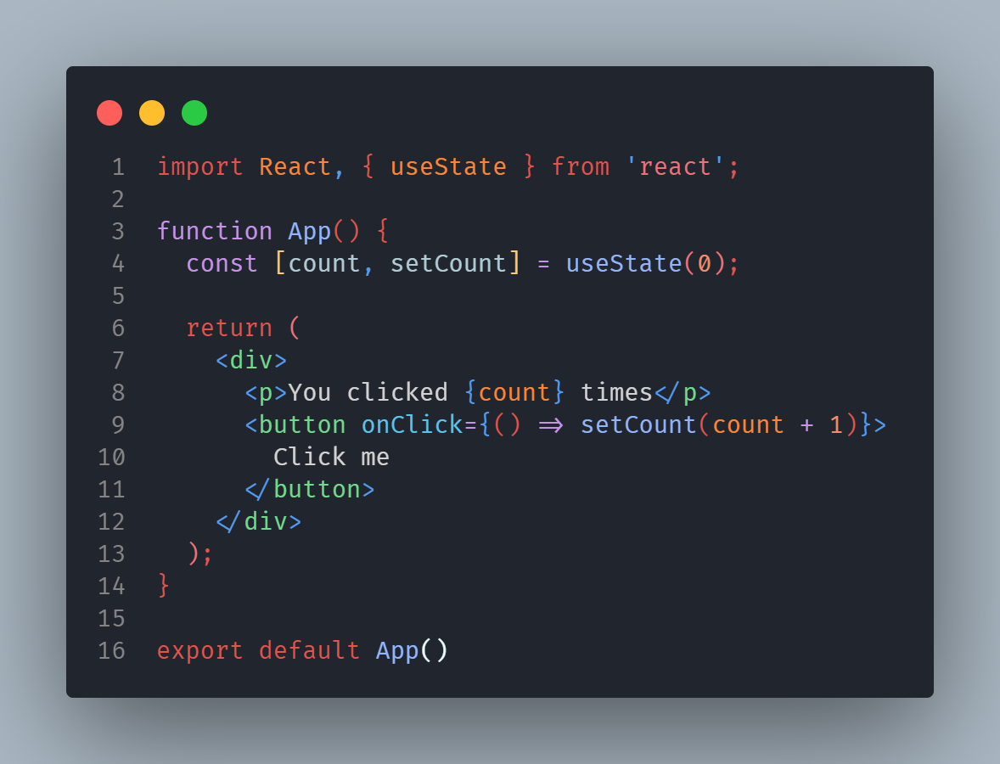
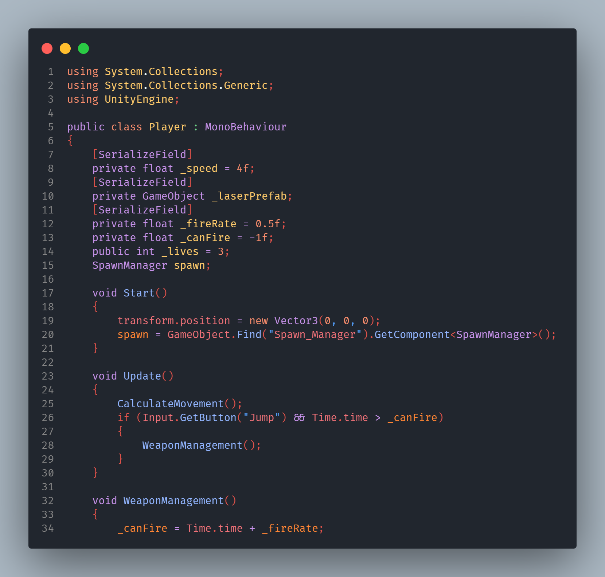

# Nighty Night 🌙

## Install

1. Go to [VS Marketplace](https://marketplace.visualstudio.com/items?itemName=ShafSpecs.nighty-night) and install the theme.

2. When prompted to select a theme, choose "Nighty Night 🌙" theme.

3. Have fun coding.

## Theme Gallery

## Override this theme defaults

To override this (or any other) theme's default color scheme in your personal config file, please follow the guide in the [color theme](https://code.visualstudio.com/api/extension-guides/color-theme) documentation. This is handy for small tweaks and changes to the theme without having to fork the repo and maintain your own theme.

## Contributing

To contribute to Nighty Night:

1. Clone and open this repo in VS Code

2. Run `npm install` to install the dependencies.

3. Press `F5` to open a new window with your extension loaded

4. Open Settings ⚙ (At the bottom of the status bar) > Color Theme [`CTRL + K` `CTRL + T`] and select "Nighty Night 🌙".

5. Make changes to the [`/themes/Nighty-color-theme.jons`](https://github.com/ShafSpecs/Nighty-Night-Theme/blob/main/themes/Nighty-color-theme.json) file.

> UI: For all changes to the "outer UI", like (status bar, file navigation etc.), take a look at the [Theme Color](https://code.visualstudio.com/api/references/theme-color) reference.

>Syntax: For changes to the "code highlighting", examine the syntax scopes by invoking the [Developer: Inspect Editor Tokens and Scopes](https://code.visualstudio.com/api/language-extensions/syntax-highlight-guide#scope-inspector) command from the Command Palette (Ctrl+Shift+P or Cmd+Shift+P on Mac) in the Extension Development Host window.

6. Run `npm build` to update the theme. You can also run `npm start` instead to automatically rebuild the theme while making changes and no reloading should be necessary.

7. Once you're satidfied with the changes, commit your changes and open a PR.

## Publishing

> **Publishing of this theme is only allowed for maintainers of this theme.**

